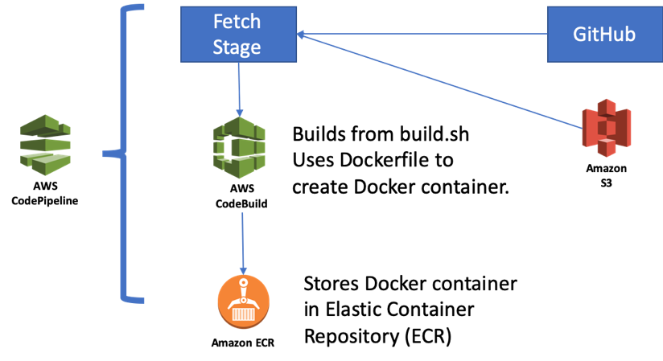
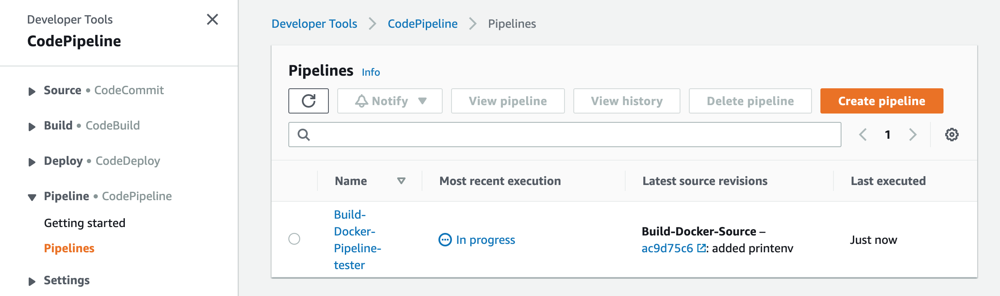
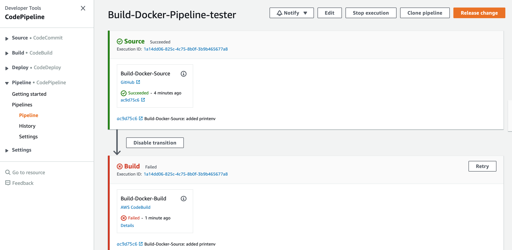

# SAT-Comp Cloud Track Instructions

The goal of the SAT-Comp Cloud Track infrastructure is to make it straightforward to build solvers that will be used in the SAT-Comp competition, and to run them at scale on Amazon Web Services (AWS) resources.

Preparing tools and testing them involves four phases, which will be described in greater detail later on in the document:

1. Creation of a test AWS Account for building your solver and running limited-scale experiments.
2. Creating the build pipeline to build your solver
3. Creating an ECS cluster where your solver will be run
4. Sharing your tools with us to run tests at scale

This project provides some sample code to set up your account and test your solver.

For each step, we have a CloudFormation template that can be used to set up the account for use with minimal effort.  These files are available in the github project at: https://github.com/aws-samples/aws-batch-comp-infrastructure-sample (which also contains this README file).  CloudFormation is AWS&#39;s approach to &quot;infrastructure as code&quot;, and it allows bulk creation of AWS resources using a relatively straightforward (if verbose) YAML format to construct resources.  It is not necessary that teams become expert CloudFormation users, but some understanding of the rudiments of CloudFormation are useful.  See: [https://aws.amazon.com/cloudformation/](https://aws.amazon.com/cloudformation/) for information and a tutorial on CloudFormation.  At each stage, we will tell you how to invoke CloudFormation to install resources into the account.

Parallel solvers are constructed by running multiple copies of a single Docker image that can communicate with one another using IP, TCP, SSH, or any number of higher-level protocols such as MPI.  We provide a Docker container image that by default has support for the use of MPI over SSH.

The containers will be hosted in an ECS cluster. See [https://aws.amazon.com/ecs/] for more details

When solvers are stable, we will use the scripts and github information to build the solver and run tests at scale.  This will allow us to report results to you as to how well the solver is performing on a set of test benchmarks when running at scale.

## Creating the Test Account

Please create a &quot;fresh&quot; account in order to simplify billing for the account.  If you have not created an AWS previously, it is straightforward to do, requiring a cell phone #, credit card, and address.  Please navigate to aws.amazon.com and follow the instructions on the web site to create an account.

If you have already created an account based on your email address, please create a separate AWS account for managing the SAT-Comp tool construction and testing.  This makes it straightforward for us to manage account credits and billing.   **Once the account is created please email us the account number at sat-comp-2021@amazon.com** so that we can apply credits to your account.
To find your account ID, click on your account name in the top right corner, and then click "My Account". You should see Account ID in the Account Settings

**N.B.:** It is very important that you tell us your account number immediately after creating the account, so that we 
can assign you a resource budget for your experiments. We also need to grant you access to the shared problem set which is in a separate S3 bucket.
Once we hear from you, we will email you in acknowledgement that the accounts have been set up with resources. 

### Installing the AWS CLI.

In order to work with AWS, you must install the AWS CLI for your platform.

To use the AWS CLI, please follow the directions for your operating system here:
  [https://docs.aws.amazon.com/cli/latest/userguide/cli-chap-welcome.html](https://docs.aws.amazon.com/cli/latest/userguide/cli-chap-welcome.html)

When setting up an account, we recommend the use of named profiles as they allow some flexibility in later connecting to multiple accounts:
  [https://docs.aws.amazon.com/cli/latest/userguide/cli-configure-profiles.html](https://docs.aws.amazon.com/cli/latest/userguide/cli-configure-profiles.html)
  
Once you have installed AWS CLI, to get the named profiles working, you should create (or modify) a ~/.aws/config file that
looks like has this:

    [profile PROFILE-NAME]
    region=us-east-1
    account=ACCOUNT-ID

where the PROFILE-NAME is any name you would like to use, and the ACCOUNT-ID is your account ID that got in the previous section.
Examples of valid regions are us-east-1 (N. Virginia), us-west-2 (Oregon), eu-west-2 (London), etc...

We also need to set up credentials to access the account. For the purposes of making the competition simple, we will use the root level
access key. This is NOT the best practice, which would be to create a user but it will suffice for the competition. If you continue
using the account beyond the competition, we recommend that you follow AWS best practices as described here:
    [https://docs.aws.amazon.com/IAM/latest/UserGuide/best-practices.html#create-iam-users](https://docs.aws.amazon.com/IAM/latest/UserGuide/best-practices.html#create-iam-users)
    
To create a root level access key, click services, and then type "IAM" into the search bar and click the resulting link. 
On the Identity and Access Management page, click on "Delete your root access keys" and then choose "My Security Credentials" from the account drop down menu on the top right of the screen.

Then click on "Access keys (access key ID and secret access key)" and then "Create New Access Key", and then "Show Access Key"
This will give you an Acess Key ID and a Secret Access Key.

Create a ~/.aws/credentials file with the following:

    [PROFILE-NAME]
    aws_access_key_id=ACCESS_KEY_ID
    aws_secret_access_key=ACCESS_KEY

After installing the AWS CLI and gaining credentials, make sure that the CLI is installed properly by attempting to run an AWS command.  An example command that should work is:

aws --profile [YOUR PROFILE NAME HERE] s3api list-buckets

If it does not work, see the troubleshooting section at the bottom of this document.

Now, we will use CloudFormation to do basic account setup.  The account-setup.yaml script sets up notification emails to be sent to the list of email accounts when the account reaches 20%, 40%, 60%, 80%, and 100% of the monthly account budget so that you have a window into the current spend rate for building and testing your solver.  

Here is the command to run it:

    aws --profile [YOUR PROFILE NAME HERE] cloudformation create-stack --stack-name setup-account-stack--template-body file://setup-account.yaml --parameters ParameterKey=emailAddress,ParameterValue=[ENTER EMAIL ADDRESS HERE]

The --profile argument should be the profile associated with the account, and the emailAddress parameter is the email address that notification messages related to budgeting and account spending will be sent.

After running the aws cloudformation command, you can monitor the installation process from the CloudFormation console  [console.aws.amazon.com/cloudformation](console.aws.amazon.com/cloudformation). 
Log into your AWS account and navigate to the CloudFormation console. Make sure you are in the region you chose in your profile (Region is selected in the top right corder)  
You should see a stack named &quot;setup-account-stack&quot;.

 
_Figure 1: Cloudformation result_

By clicking on this stack, and choosing &quot;events&quot;, you can see the resources associated with the stack.  After a short time, you should see the &quot;CREATE\_SUCCEEDED&quot; event.   If not (e.g., the email address was not valid email address syntax), you will see a &quot;CREATE\_FAILED&quot; event.  In this case, delete the stack and try again.  If you have trouble, please email us at: [sat-comp-2021@amazon.com](mailto:sat-comp-2021@amazon.com) and we will walk you through the process.

Although it is handy to get emails when certain account budget thresholds have been met, it is also possible to check by-the-minute account spending on the console: [https://console.aws.amazon.com/billing/home](https://console.aws.amazon.com/billing/home)

## Building the Solver

Solvers should be buildable from source code using a standard process.  It is expected that you will provide a GitHub repo that has a Dockerfile in the top directory. We have provided the following Github repo as an example: https://github.com/aws-samples/aws-batch-hordesat-sample.

 
_Figure 2: Overview of the Build Process_

An overview of the build process is shown in Figure 1. The build mechanism creates a docker container from provided source files and stores it in the Amazon ECR (Elastic Container Repository) service.

### Building Sources from GitHub

To build sources from GitHub, a GitHub OAuth token is required.  You can find this on your Github account settings page, on the sidebar go into developer settings and then Personal Access Tokens. You should give read access to your repo.

This OAuth token allows CodePipeline to query the state of the GitHub repository and to rebuild the solver when changes occur.

We have a shell script that, for Mac OS and linux, can create the pipeline.  It requires 6 arguments (sorry!) and creates the architecture shown in Figure 1.  Here is the syntax for the command:

    ./build-solver-pipeline-github.sh PROFILE PROJECT_NAME GITHUB_TOKEN REPOSITORY_OWNER REPOSITORY_NAME REPOSITORY_BRANCH_NAME
where:

**   PROFILE is a AWS CLI profile with administrator access to the account    **

**   PROJECT\_NAME is the name of the project.  MUST BE ALL LOWERCASE.**

**       Regular expression for names is:**

**       (?:[a-z0-9]+(?:[.\_-][a-z0-9]+)\*/)\*[a-z0-9]+(?:[.\_-][a-z0-9]+)\*  **

**   GITHUB\_TOKEN is a GITHUB OAuth token that can clone public repositories  **

**   REPOSITORY\_OWNER is the owner of the repository**

**   REPOSITORY\_NAME is the name of the repository**

**   REPOSITORY\_BRANCH\_NAME is the branch of the repository to use**

**N.B.: The Cloudformation script will fail if the &quot;PROJECT\_NAME&quot; parameter is not a lower-case string that follows the regular expression shown in the command arguments above.**

After running the shell command, you can monitor the progress of the CloudFormation account by logging into the CloudFormation console (as described above for the account setup script).  The stack name will be **build-PROJECT\_NAME** , where PROJECT\_NAME is the name of the project that you used in the shell script.

If errors occur, please delete the stack (as described above for the account setup script), determine the error in parameters (e.g., did you use lower-case for the PROJECT\_NAME?) and re-run the build-solver-pipeline-github.sh script.  If you encounter difficulties, please email us at: [sv-comp-2021@amazon.com](mailto:sv-comp-2021@amazon.com) and we will walk you through the process.

### Debugging the Build Process

It is unlikely that the solver build will work the first time.  Fortunately, CodePipeline and CodeBuild, the services that perform the build, have good logging and error reporting.

To get started, log in to your account and navigate to the CodePipeline console [console.aws.amazon.com/codepipeline](console.aws.amazon.com/codepipeline).  You should see a pipeline that looks like the following:

The two phases of the build process are the &quot;Source&quot; stage, where artifacts are read from GitHub, and the &quot;Build&quot; stage, where the code is built and a docker container is stored in ECR.

**Debugging the Source Stage:**

For &quot;Source&quot;, if the build process was able to access GitHub, you should see a green check.  If you see a red &#39;X&#39; instead, there is some misconfiguration.

If building from GitHub, examine the error that is returned and carefully check that the OAuth token, account owner, project name, and branch correspond to the actual GitHub project.  In this case, navigate to the CloudFormation console, delete the **build-PROJECT\_NAME** stack, and rebuild the stack using the correct github information.

**Debugging the Build Stage:**

We can monitor the build stage in CodeBuild by going to this console:  [console.aws.amazon.com/codebuild](console.aws.amazon.com/codebuild) . The build stage builds the Dockerfile at the top level of the directory structure.  The docker file in our example entry repository should work for this purpose without any changes.  Include this Dockerfile at the top-level of your directory structure.

The container used by CodeBuild to build your tool contains recent versions of GCC, Java, Scala, Ruby, Python, and many standard build utilities for linux.  When performing a build, it creates a log of the build activity.  To debug the build process, please navigate to the CodeBuild service from the AWS Console.  From there, it is possible to see success/failure of recent builds and logs of the build.

Successful builds will create a Docker container that is stored in ECR.  If a build is successful, you should see a container image in ECR.  To verify a build was successful, navigate to ECR and check to see whether a container was created.

Although the build process usually succeeds, Docker is now sometimes limiting how much we can pull images in Codebuild.
If this happens, you may have to build your container locally and push it manually. 

To do this, go into your AWS console in the ECR service: [console.aws.amazon.com/ecr](console.aws.amazon.com/ecr). 
Click on the repository with your project name and then in the top right corner, click the "View push commands" button.

Follow the instructions here to manually push your container image.

If you encounter difficulties with the debugging process, please email us at: [sv-comp-2021@amazon.com](mailto:sv-comp-2021@amazon.com) and we will walk you through the process.

## Building the ECS cluster that will run the solver

The next step is to build the Batch environment that will run the solver.  This is relatively straightforward, and a script is provided to construct the batch environment.

The batch environment is designed to allow testing at small scale, and consists of four 16-core machines.  This should be sufficiently large to allow testing that the communication between containers works properly and that parallel solving is working, but not so large as to become expensive for testing.  For large-scale testing, we ask that, after the solver is stable, you provide us with links to the repository/S3, and we will run your solver at large-scale.

To set up the batch pipeline, run the job-queue.sh file:

    ./build-job-queue.sh PROFILE REGION PROJECT_NAME INSTANCE_TYPE INSTANCE_AMI
where:
   PROFILE is a AWS CLI profile with administrator access to the account**

**   PROJECT\_NAME is the name of the project.  MUST BE ALL LOWERCASE.**

** The INSTANCE_TYPE is the machine you want to run on. For the cloud track, this should be m4.4xlarge, and for parallel track it should be m4.16xlarge 

** INSTANCE_AMI To get the instance AMI, please go to https://docs.aws.amazon.com/AmazonECS/latest/developerguide/ecs-optimized_AMI.html and select the Amazon Linux 2 AMI for your region. These are both region specific and are updated frequently which is why we cannot give a default.

**      Regular expression for names is:**

**      (?:[a-z0-9]+(?:[.\_-][a-z0-9]+)\*/)\*[a-z0-9]+(?:[.\_-][a-z0-9]+)\*&quot;**

PROJECT\_NAME must be the same name that you used earlier for the build-solver-pipeline script.

     
Once again, monitor the creation of resources from the script by navigating to the CloudFormation console.

## Running the Solver

To run the solver, we have to point it at a test directory and pass in arguments.  The solver will run in AWS Batch as a multi-node parallel job: [https://docs.aws.amazon.com/batch/latest/userguide/multi-node-parallel-jobs.html](https://docs.aws.amazon.com/batch/latest/userguide/multi-node-parallel-jobs.html)

This approach allocates resources for parallel execution, sets up a &#39;main node&#39; with an IP address that is started first.  Once executing, a set of &#39;child nodes&#39; is started, and the IP address of the main node is passed to all child nodes, so that they can communicate back to the main node.

The infrastructure we are using to run the examples is EC2 clusters managed using ECS. 
In order to use this cluster, you will have to explicitly spin up EC2 instances.

Since you will now be responsible for spinning up and down your own instances, if you want to run an experiment, you will have to manually modify your cluster to include the number of instances you need, and then manually spin it down. 

__IMPORTANT!!!: If you do not spin down your cluster, you will be responsible for the cost of accidentally leaving instances running__
 
To control the instances in your cluster, go to the ECS console and click on the SatCompCluster. Then click the tab that says ECS Instances and click the link that says “Auto Scaling”.
 In the list, you will see an autoscaling group called something like job-queue-PROJECT_NAME-EcsInstanceAsg-.... 
 Select that, and click Edit. 
 Set the Desired Capacity __and__ Maximum Capacity to 2 (or however many instances you need). 
 When you are finished you experiment, please set these values back to 0.
 
Please allow 2-3 minutes for the instances to boot up and register with the cluster. 
If you get the following error, it means that your instances have not yet booted up:

    An error occurred (InvalidParameterException) when calling the RunTask operation: No Container Instances were found in your cluster.
     
If they fail to boot up after 5 minutes, please verify that both Desired Capacity and Maximum Capacity are set correctly.
 
You will incur costs for the time the machines are running.

__Do not forget to spin down the cluster when it is not in use!!!__
### run_example.py

We have prepared a Python script that will give an example of how these solver containers will be run. 
It will create two instances of your Docker container in ECS, assuming the first is the "Main" node and the second is the "Worker" node.
It will wait until the Main node is spun up, and then spin up the worker Node with the IP of the Main node in an environment variable.
Notice that the Main node must declare its IP address in the standard output by printing a line that says "main IP: ${IP_ADDRESS}".

Once the main Node terminates, the script will terminate the worker node and print the full log of the Main node. 
This is exactly how we will run the competition.

To run the script run:

    ./run_example.py --profile PROFILE --project-name PROJECT-NAME  --file test.cnf

By default this will run the Cloud version of the script which will spin up 2 jobs.
For the Parallel version that will only spin up one job, please run the following command:

    python3 run_example.py --profile fake-prod-east-2 --project-name hordesat-test -f test.cnf --cloud False

Where profile is your aws profile as configured in ~/.aws/config, the PROJECT_NAME is whatever name you gave your project
in the previous steps. test.cnf is an UNSAT example in our shared S3 bucket that can be solved quickly. 
We will add more test examples shortly.
 

If you look at the script itself, you will see that we are actually passing the name of the S3 bucket and the full path 
to the problem being solved as a container environment variable. You can use a different S3 bucket if you have your own
problems you would like to experiment with.

In addition to the environment variables we are passing, there are some environment variables with metadata that can be used from within the container:

AWS\_BATCH\_JOB\_MAIN\_NODE\_INDEX

This variable is set to the index number of the job&#39;s main node. Your application code can compare the AWS\_BATCH\_JOB\_MAIN\_NODE\_INDEX to the AWS\_BATCH\_JOB\_NODE\_INDEX on an individual node to determine if it is the main node.

AWS\_BATCH\_JOB\_MAIN\_NODE\_PRIVATE\_IPV4\_ADDRESS

This variable is only set in multi-node parallel job child nodes (it is not present on the main node). This variable is set to the private IPv4 address of the job&#39;s main node. Your child node&#39;s application code can use this address to communicate with the main node.

AWS\_BATCH\_JOB\_NODE\_INDEX

This variable is set to the node index number of the node. The node index begins at 0, and each node receives a unique index number. For example, a multi-node parallel job with 10 children has index values of 0-9.

AWS\_BATCH\_JOB\_NUM\_NODES

This variable is set to the number of nodes that you have requested for your multi-node parallel job.

To see the results of your run, simply look at the logs as described in the next section.

### Monitoring and Logging

The ECS console allows you to monitor the logs of all running tasks. For information about the ECS console please refer to the documentation: https://aws.amazon.com/ecs/

## Example

We have an example repository with a Dockerfile that builds and runs Hordesat in the following git repo: https://github.com/aws-samples/aws-batch-hordesat-sample

## Troubleshooting

TBD
