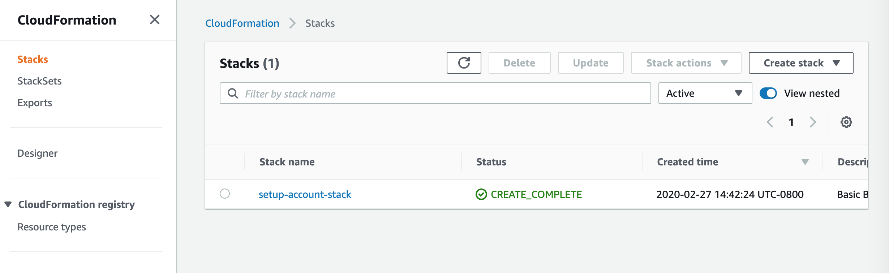

# SAT-Comp and SMT-Comp Cloud Track Instructions


The goal of the SAT-Comp / SMT-Comp Cloud Track infrastructure is to make it straightforward to build distributed solvers that will be used in the competitions, and to run them at scale on Amazon Web Services (AWS) resources.

Preparing tools for the competition involves four phases, described in this document: 

1. Creating and configuring a test AWS Account 
2. Setting up infrastructure to run an example distributed solver.
3. Creating your own solver and running experiments.
4. Once ready, sharing the solver repository and Docker image with us for the competition.

This project provides the infrastructure necessary to build and test solvers, including an example solver that will work with the infrastructure.  To create the resources within an account necessary to run distributed solvers, we provide CloudFormation templates [https://aws.amazon.com/cloudformation/](https://aws.amazon.com/cloudformation/), and Docker base images.  The CloudFormation templates create the account infrastructure necessary to run solvers, and the Docker base images simplify the construction of the solvers themselves.


## Prerequisites

To install the infrastructure described in this document, you need the following tools installed:

- [python3](https://www.python.org/)
- [awscli](https://aws.amazon.com/cli/)
- [boto3](https://aws.amazon.com/sdk-for-python/)
- [docker](https://www.docker.com/)

It is expected that solver writers are familiar with Docker, and can construct Docker images from Dockerfiles.  If not, there are a number of excellent tutorials, such as [this one](https://docs.docker.com/get-started/).  Also, basic knowledge of AWS accounts and services is helpful, though we try to walk you through the necessary pieces.


## Creating the Test Account

Please create a &quot;fresh&quot; account in order to simplify billing for the account.  If you have not created an AWS account previously, it is straightforward to do, requiring a cell phone #, credit card, and address.  Please navigate to [aws.amazon.com](https://aws.amazon.com) and follow the instructions on the web site to create an account.

If you have already created an account based on your email address, please create a separate AWS account for managing the SAT/SMT-Comp tool construction and testing.  This makes it straightforward for us to manage account credits and billing.   Once the account is created please email us the account number at: sat-comp-2022@amazon.com (for SAT-Comp) or aws-smtcomp-2022@googlegroups.com (for SMT-Comp) so that we can apply credits to your account.
To find your account ID, click on your account name in the top right corner, and then click "My Account". You should see Account ID in the Account Settings

**N.B.:** It is very important that you tell us your account number immediately after creating the account, so that we
can assign you a resource budget for your experiments. We also need to grant you access to the shared problem set which is in a separate S3 bucket.
Once we hear from you, we will email you an acknowledgment that the accounts have been set up with resources.


### Installing the AWS CLI

In order to work with AWS, you must install the [AWS CLI](https://aws.amazon.com/cli/) for your platform.

To use the AWS CLI, please follow the directions for your operating system here:
  [https://docs.aws.amazon.com/cli/latest/userguide/getting-started-install.html](https://docs.aws.amazon.com/cli/latest/userguide/getting-started-install.html)

When setting up an account, we recommend the use of _named profiles_ as they allow some flexibility in later connecting to multiple accounts:
  [https://docs.aws.amazon.com/cli/latest/userguide/cli-configure-profiles.html](https://docs.aws.amazon.com/cli/latest/userguide/cli-configure-profiles.html)

Once you have installed AWS CLI, to get the named profiles working, you should create (or modify) a ~/.aws/config file that
looks like has this:

    [profile PROFILE-NAME]
    region=us-east-1
    account=ACCOUNT-ID

where the PROFILE-NAME is any name you would like to use, and the ACCOUNT-ID is the id of the account you created in the previous section.
Examples of valid regions are us-east-1 (N. Virginia), us-west-2 (Oregon), eu-west-2 (London), etc...

**THE REST OF THIS GUIDE ASSUMES THAT THE REGION IS `us-east-1`.  IF YOU CHOOSE A DIFFERENT REGION, PLEASE REPLACE `us-east-1` WITH YOUR REGION.  This can be performed by a simple find/replace on this document.  We recommend that you use the region `us-east-1` when going through the steps described in this document.**

### Creating Credentials ###

You also need to set up credentials to access the account. For the purposes of making the competition simple, you will use a so-called _root level
access key_. This is NOT the best practice (which would be to create a user) but it suffices for the competition. If you continue
using the account beyond the competition, we recommend that you follow AWS best practices as described here:
    [https://docs.aws.amazon.com/IAM/latest/UserGuide/best-practices.html#create-iam-users](https://docs.aws.amazon.com/IAM/latest/UserGuide/best-practices.html#create-iam-users)

To create a root level access key go to the [IAM Console](https://console.aws.amazon.com/iamv2/) (you can get there either by clicking the link or by searching for "IAM" in the search field on the top of the [AWS Console](https://console.aws.amazon.com) and then clicking the resulting link).
On the Identity and Access Management page, click on "Delete your root access keys" and then choose "My Security Credentials" from the account drop down menu on the top right of the screen.

Then click on "Access keys (access key ID and secret access key)" and then "Create New Access Key", and then "Show Access Key"
This gives you an Access Key ID and a Secret Access Key.

Create a `~/.aws/credentials` file with the following:

    [PROFILE-NAME]
    aws_access_key_id=ACCESS_KEY_ID
    aws_secret_access_key=ACCESS_KEY
    region=us-east-1


After installing the AWS CLI and gaining credentials, make sure that the CLI is installed properly by attempting to run an AWS command.  An example command that should work is:
```text
aws --profile [PROFILE_NAME] sts get-caller-identity
```

In case you get an error message, see the [Troubleshooting](#troubleshooting) section at the bottom of this document.

We recommend that once you've gone through the steps for setting up the AWS Solver Infrastructure, you follow the steps in the section [Basic Account Configuration](#basic-account-configuration) to track your spending. For now, we'll continue with the setup.

### Creating the AWS Solver Infrastructure within the Account

The next step is to create the AWS infrastructure necessary to build and test solvers.  The SAT and SMT competitions use the following AWS capabilities to host distributed solvers: 

* The compute resources necessary to host the solver, provided by the [Elastic Compute Cloud](https://aws.amazon.com/ec2/) (EC2) service,
* A registry for the Docker image files containing the solver workers and leader, provided by the [Elastic Container Registry](https://aws.amazon.com/ecr/) (ECR) service,
* A compute environment to support automating launching of containers on compute resources, provided by the [Elastic Container Service](https://aws.amazon.com/ecs/) (ECS) service,  
* An archival storage location where CNF problems are stored, using the [Simple Storage Service](https://aws.amazon.com/s3/) (S3) service,
* A distributed file system that can be used for communicating between the leader and worker solvers, using the [Elastic File System](https://aws.amazon.com/efs/) (EFS) service, and
* A problem queue that the solver uses to extract the next problem to solve, provided by the [Simple Queue Service](https://aws.amazon.com/sqs/) (SQS).


For each of the services above, click the associated link to learn more about the service.  We will also explain how these services interact in more detail in the &quot;Extending the Competition Base Container&quot; section of this document.


To set up the account resources, run the `create-solver-infrastructure` script:

```text
./create-solver-infrastructure --profile PROFILE_NAME --project PROJECT_NAME --instance INSTANCE_TYPE --ami INSTANCE_AMI
```

where:

**PROFILE\_NAME:** is the name of the AWS Profile you created and used in the steps above.

**PROJECT\_NAME:** is the name of the project.  **N.B.:** `PROJECT_NAME` must start with a letter and can only contain lowercase letters, numbers, hyphens (-), underscores (_), and forward slashes (/).

**INSTANCE\_TYPE:** is the machine instance type you wish to use.  A machine instance type describes the capabilities such as CPU, memory, and networking of a compute node.  EC2 has many [instance types](https://aws.amazon.com/ec2/instance-types/) for a variety of different compute workloads.  For the cloud track, the instance type should be `m6i.4xlarge`, and for parallel track it should be `m6i.16xlarge`.

**INSTANCE\_AMI:** The instance AMI describes the [Amazon Machine Image](https://docs.aws.amazon.com/AWSEC2/latest/UserGuide/AMIs.html), the basic software image to be loaded onto each EC2 instance, that describes the operating system and other configuration information.  To get the instance AMI to use for the competition resources, please use the following command:

```text
    aws --profile [PROFILE_NAME] ssm get-parameters --names /aws/service/ecs/optimized-ami/amazon-linux-2/recommended
```

in the result, the AMI is the "image_id" field.

For example, here is result from this call:

```text
{
    "Parameters": [
        {
            "Name": "/aws/service/ecs/optimized-ami/amazon-linux-2/recommended",
            "Type": "String",
            "Value": "{\"ecs_agent_version\":\"1.60.0\",\"ecs_runtime_version\":\"Docker version 20.10.7\",\"image_id\":\"ami-0bb273345f0961e90\",\"image_name\":\"amzn2-ami-ecs-hvm-2.0.20220304-x86_64-ebs\",\"image_version\":\"2.0.20220304\",\"os\":\"Amazon Linux 2\",\"schema_version\":1,\"source_image_name\":\"amzn2-ami-minimal-hvm-2.0.20220218.1-x86_64-ebs\"}",
            "Version": 83,
            "LastModifiedDate": "2022-03-07T12:52:55.037000-06:00",
            "ARN": "arn:aws:ssm:us-east-1::parameter/aws/service/ecs/optimized-ami/amazon-linux-2/recommended",
            "DataType": "text"
        }
    ],
    "InvalidParameters": []
}
```

and the instance AMI from the image_id is: `ami-0bb273345f0961e90`.  **N.B.: do *not* use** `ami-0bb273345f0961e90` as your instance AMI.  Instead, please use the result of the command above when you run it.  Instance AMIs are both region-specific and updated frequently, so we cannot provide a default.

The `create-solver-infrastructure` script takes 5-10 minutes to run.  At this point, all the cloud resources should be created.

### Creating the Base Docker Leader and Worker Images for Solvers

To simplify the solver construction process, this year we are providing two base Docker images that manage most of the infrastructure necessary for solvers and mediate access to AWS resources.  You must extend these images in order to create the leader and worker images to use for the competition.  Teams will build these images on their local workstation and extend the images to construct their solvers.


#### Build `satcomp-common-base:latest` image

1. from the repo root directory, cd to the `src/satcomp-common-base-image` directory.
2. run `docker build -t satcomp-common-base-image .`

#### Build `satcompbase:leader` image

1. from the repo root directory, cd to the `src` directory
2. run `docker build -f satcomp-leader-image/Dockerfile -t satcomp-base:leader .`

#### Build `satcompbase:worker` image

1. from the repo root directory, cd to the `src` directory
2. run `docker build -f satcomp-worker-image/Dockerfile -t satcomp-base:worker .`

#### Check to make sure the images have built successfully:
1. run `docker image ls`
2. make sure that you see `satcomp-common-base-image`, `satcomp-base:leader`, and `satcomp-base:worker` in the list of images.

## Building and Running a Solver 

We provide an example repository with a Dockerfile that builds a distributed solver from the base images in the following git repo: [https://github.com/aws-samples/aws-satcomp-solver-sample](https://github.com/aws-samples/aws-satcomp-solver-sample).  In order to test the infrastructure here, please follow the build steps detailed in the `README.md` file for that repository.   

After following the build steps in that repository described in the `README.md` file, the sample solver should work &quot;out of the box&quot; on the steps below.   After you have this solver working, you can create your own solver as described in the section on &quot;extending solvers&quot; below.

Once you have built the leader and worker images locally following the directions for the sample, we need to upload them to the Elastic Container Registry.


### Storing Solver Images in the ECR repository

Navigate to the [Elastic Container Registry (ECR) console](https://console.aws.amazon.com/ecr) for your solver account.

The `create-solver-infrastructure` command described earlier creates two ECR repositories:

```text
[PROJECT_NAME]-leader
[PROJECT_NAME]-worker
```

These repositories store the images for the leader and worker.

Each of these repositories has an associated URI (shown on the console page), which is what we use to push docker images to ECR.
The format for URIs is

```text
[AWS_ACCOUNT_ID].dkr.ecr.[REGION_NAME].amazonaws.com/[REPOSITORY_NAME]
```

You will use these URIs to describe where to store our Docker images in AWS.  

**N.B.:** a good way to make sure that you type these URI names correctly is to navigate to the Elastic Container Registry (ECR) console in AWS and copy them from the page (the names are in the URI column).   


To store a Docker image in ECR from your local machine, first you need to login to ECR:

```text
aws --profile [PROFILE_NAME] ecr get-login-password --region us-east-1 | docker login --username AWS --password-stdin [AWS_ACCOUNT_ID].dkr.ecr.us-east-1.amazonaws.com
```

Next, you need to tag the image to match the ECR repository.  For the worker, tag the image as:

```text
docker tag [LOCAL_WORKER_IMAGE_ID] [AWS_ACCOUNT_ID].dkr.ecr.us-east-1.amazonaws.com/[PROJECT\_NAME]-worker
```

where 

* **LOCAL\_WORKER\_IMAGE\_ID** is the local worker image tag (e.g., `my-solver:leader`).  For the sample solver, this image tag is described in the `README.md` instructions.  
* **AWS\_ACCOUNT\_ID** is the account ID where you want to store the image.
* **PROJECT\_NAME** is the name of the project that you chose in the &quot;Creating the AWS Infrastructure&quot; section above.

For the leader, tag the image as:

```text
docker tag [LOCAL_LEADER_IMAGE_ID] [AWS_ACCOUNT_ID].dkr.ecr.us-east-1.amazonaws.com/[PROJECT_NAME]-leader
```

where 

* **LOCAL\_LEADER\_IMAGE\_ID** is the local image for the leader, and the other parameters are the same as for the worker.

After these steps, you can docker push the images:

```text
docker push [AWS_ACCOUNT_ID].dkr.ecr.us-east-1.amazonaws.com/[PROJECT_NAME]-leader
docker push [AWS_ACCOUNT_ID].dkr.ecr.us-east-1.amazonaws.com/[PROJECT_NAME]-worker
```

You should see network progress bars for both images.

More information related to the ECR procedures is described here: [https://docs.aws.amazon.com/AmazonECR/latest/userguide/docker-push-ecr-image.html](https://docs.aws.amazon.com/AmazonECR/latest/userguide/docker-push-ecr-image.html).

If you have trouble, please email us at: [sat-comp-2022@amazon.com](mailto:sat-comp-2022@amazon.com) and we will walk you through the process.


## Adding Problems to an S3 Bucket.

Before you can run the solver, you have to add the problems to be solved to an S3 bucket that is accessible by your account. As part of the `create-solver-infrastructure` CloudFormation script, we have created a bucket for you where you can store files: `[ACCOUNT\_ID]-us-east-1-satcompbucket`, and added a `test.cnf` file to this bucket for testing (if you chose a different region than `us-east-1`, the part `us-east-1` in the bucket name my vary accordingly).  You can start with this `test.cnf` example and skip the rest of this section until you wish to add additional files or buckets for testing your solver.


In case you wish to create a bucket, here is a command to create a bucket named `[PROJECT_NAME]-satcomp-examples`:

```text
aws --profile [PROFILE_NAME] s3api create-bucket --bucket [PROJECT_NAME]-satcomp-examples
```

**Note: this creates the bucket in the AWS region specified in your named profile**

**Note: If you chose a different region than `us-east-1`, you might get an `IllegalLocationConstraintException`. To deal with the problem, you have to append the argument `--create-bucket-configuration {"LocationConstraint": "YOUR-REGION-NAME"}` to the command, where `YOUR-REGION-NAME` is replaced with the name of the region you chose.**

**Note: S3 buckets are globally unique across all of AWS, which means that the command will fail if someone else is already using the same bucket name.  A simple fix is to add the AWS account number to the bucket name, which will likely yield a unique bucket name.**

Once the bucket is created, you can copy files to the bucket with a command similar to this one (when executed from the root directory of this repsository, this re-copies the `test.cnf` file to the default bucket):

```text
aws --profile [PROFILE_NAME] s3 cp test.cnf s3://[ACCOUNT_ID]-us-east-1-satcompbucket
```

Once this command completes successfully, you should see this object in the list of objects in the bucket:

```text
aws --profile [PROFILE_NAME] s3 ls [ACCOUNT_ID]-us-east-1-satcompbucket
```

More information on creating and managing S3 buckets is found here: [https://aws.amazon.com/s3/](https://aws.amazon.com/s3/),
and the command line is described in more detail here: [https://docs.aws.amazon.com/cli/latest/userguide/cli-services-s3-commands.html](https://docs.aws.amazon.com/cli/latest/userguide/cli-services-s3-commands.html).


## Running the Distributed Solver
Once you have populated a bucket with at least one CNF file in DIMACS format, and stored a docker image for both `[PROJECT_NAME]-leader` and `[PROJECT_NAME]-worker`, you can try to run your solver.

Running the solver consists of three steps:

1. Setup:
   
    a. Setting capacity for the cluster in [EC2](https://aws.amazon.com/ec2/).
    
    b. Setting the desired number of workers in [ECS](https://aws.amazon.com/ecs/).
    
2. Run: submitting a solve job to the SQS queue by specifying the S3 location of the problem and the desired number of workers.
3. Cleanup: setting the capacity in EC2 for the cluster back to zero.

After setup, you should be able to run any number of solve jobs before cleaning up.

**It is important that you [clean up](#cluster-teardown) once you are done.  EC2 nodes that remain active continue to be charged against your account.**

### Cluster Setup

To set up and tear down the cluster, we have provided a script called `update_instances`.  You provide the number of desired worker nodes, and it will:
 
1. create an EC2 fleet large enough to run the experiment (number of workers + 1 leader node)
2. create the correct number of desired tasks in the ECS service for the workers and the leader.

To run the script: 

```text
update_instances --profile [PROFILE_NAME] --option setup --workers [NUM_WORKERS]
```

where: 

* **PROFILE\_NAME** is the profile name for the account
* **NUM\_WORKERS** is the number of worker nodes you would like to allocate. To avoid any problems with possible resource limits for your AWS account, we recommend that you set `NUM\_WORKERS` to `1` when going through the steps of this document for the first time.

After requesting the nodes from EC2 and ECS, AWS normally requires between 2-5 minutes to allocate the machines and host the ECS cluster.  

If you wish, you can monitor the creation process from the ECS console as follows: 

Navigate to the [ECS console](https://us-east-2.console.aws.amazon.com/ecs), then select the SatCompCluster link.

The next page should show a list of job queues, including:

```text
job-queue-PROJECT_NAME-SolverLeaderService-...
job-queue-PROJECT_NAME-SolverWorkerService-...
```

The service is running and available when the number of running tasks for the leader is `1` and that the number of running tasks for the Worker service is `n`, where _n_ is the number of desired tasks, which should match `NUM_WORKERS` from the script arguments.

**N.B.:** you are charged for the number of EC2 instances that you run, so the bill for computation is directly proportional to the number of workers that you allocate.  

### Job Submission and Execution

First, ensure a cluster is set up and running, and the desired .cnf problem is available in an accessible S3 bucket.

To submit a job by sending a SQS message.  We have provided a script called `send_message` that will submit an SQS job.  You provide the location of the file to run and number of desired worker nodes, and it will submit a SQS request to the `[ACCOUNT_NUMBER]-[REGION]-SatCompQueue` queue which will trigger execution of the solver.


To run the script: 

```text
send_message --profile [PROFILE_NAME] --location [S3_LOCATION] --workers [NUM_WORKERS]
```

where: 

* **PROFILE\_NAME** is the profile name for the account.
* **LOCATION** is the s3 location of the .cnf file.  For example, for the bucket we described earlier, the location would be s3://[ACCOUNT_ID]-us-east-1-satcompbucket/test.cnf (where ACCOUNT_ID is the account number you used).
* **NUM\_WORKERS** is the number of worker nodes you would like to allocate. To avoid any problems with possible resource limits for your AWS account, we recommend that you set `NUM\_WORKERS` to `1` when going through the steps of this document for the first time.


The leader base container infrastructure will pull the message off of the queue, find the problem in S3 and begin running it.  For more information on the steps performed, please read the [section on Extending the Solver Base Container](#understanding-the-solver-architecture-and-extending-the-competition-base-leader-container) below.  

### Monitoring and Logging

Currently, the best way to examine the status of the solvers is by examining the logs.  These are available from the CloudWatch log groups.  There should be logs related to `/ecs/[PROJECT_NAME]-leader` and `/ecs/[PROJECT_NAME]-worker`.  These logs will capture both stdout and stderr from the container images.

The ECS console allows you to monitor the logs of all running tasks. For information about the ECS console please refer to the documentation: [https://aws.amazon.com/ecs/](https://aws.amazon.com/ecs/).


### Cluster Teardown

After testing, tear down the cluster by running: 

```text
update_instances --profile [PROFILE_NAME] --option shutdown
```

This will terminate all EC2 instances and reset the number of leaders and workers to zero in the ECS service. 

Be sure to check that no EC2 instances are running after running the teardown script.  Navigate to the [EC2 console](https://console.aws.amazon.com/ec2) for the account and check the Instances tab.  There should be no running instances.  Note that it might take a minute or two for the instances to shut down after running the script.

**N.B.: You are responsible for any charges made to your account.  While we have tested the shutdown script and believe it to be robust, you are responsible for monitoring the EC2 cluster to make sure resources have shutdown properly.  We have alternate directions to shutdown resources using the console in the Q&A section.**


## Understanding the Solver Architecture and Extending the Competition Base Leader Container

In previous years, we asked participants to provide a Dockerfile which would build a container that would handle all of the coordination between nodes, as well as downloading problems from S3 and all interactions with AWS.
This meant that the Dockerfiles were quite complicated and included things which are common to all solvers such as retrieving problems from S3 or setting up openssh-server.  This required duplicate effort on the part of each team.
It also meant that when running the competition, we often found bugs that were not related to the solvers themselves, but rather to environments that had not been configured properly.

This year, we have modified the architecture used in previous competitions to try to make it simpler for competitors to build solvers.  Most of the infrastructure necessary for interacting with AWS services is managed in separate Docker base images for the leader node of the solver and the worker nodes.

The Leader Node base container is responsible for pulling work off a queue, downloading the problem instance from S3, sharing the problem with Worker Nodes, and collecting the IP addresses of all the available worker nodes before starting the solving process.

The Worker Node base container is responsible for reporting its status and IP address to the Leader Node.


### Building from Competition Base Containers

Solvers must be buildable from source code using a standard process.  We use Docker to create a build process that can easily be standardized.  Docker removes many of the platform-specific problems with building under one operating system and running in another.

You must provide a GitHub repo that has a Dockerfile in the top directory that we will use to build your solver. The following Github repo is an example: [https://github.com/aws-samples/aws-satcomp-solver-sample](https://github.com/aws-samples/aws-satcomp-solver-sample).

This year we will ask participants to supply two Dockerfiles for their solver, one that acts as a Leader Node and one that acts as a Worker Node.

Participants should begin their Dockerfiles with:

```text
    FROM satcomp-base:leader
```
or

```text
    FROM satcomp-base:worker
```

The base images (which are based on ubuntu:20.04) have predefined entrypoints which start when the container is invoked.
This entrypoint handles all interaction with the competition infrastructure.
This means that participants are only responsible for invoking their solver, and should not have to write code for most of the interactions with AWS resources.

#### Leader Base Container
The Leader Base Container does the following steps: 

1. Pull and parse a message from the `[ACCOUNT\_NUMBER]-[REGION]-SatCompQueue` SQS queue with the format described in the Job Submission and Execution section above,  
1. Pull a competition problem from S3 from the location provided in the SQS message,
1. Save the competition problem on a shared EFS drive so that it can be accessed by all of the worker nodes,
1. Wait until the requested number of workers have reported their status as READY along with their IP address,
1. Create a working directory for this problem task,
1. Write an `input.json` with the IP addresses of the worker nodes as well as the location of the problem to the working directory,
1. Invoke the executable script located at path `/competition/solver` with a single parameter: the path to the working directory, and
1. Upon task completion, notify all workers that the task has ended.

The competition participant must provide the `/competition/solver` script which contains
the code to invoke their solver and to coordinate with the Worker nodes if needed.

Here is an example of the `input.json` file:

```text
{
  "problem_path": "/mount/efs/problem.cnf",
  "worker_node_ips": ["192.158.1.38", "192.158.2.39", ...]
}
```

The Leader Base Container waits until the `/competition/solver` script has completed, and looks for a `solver_out.json` file with the following format:

```text
{
  "return_code": Number, // of running the solve command
  "result": String,      // Should be one of {"SAT", "UNSAT", "UNKNOWN", "ERROR"}
  "artifacts": {
    "stdout_path": String, // Where to find the stdout of the solve run
    "stderr_path": String  // Where to find the stderr of the solve run
  }
}
```


You can extend the competition base image (either Leader or Worker) by writing your own `/competition/solver` script and copying it to a new container which is based on the Competition Base Container.

NOTE: We have provided a fully fleshed out example of how to do this in the following github repo: [https://github.com/aws-samples/aws-satcomp-solver-sample](https://github.com/aws-samples/aws-satcomp-solver-sample).

For example:

```text
FROM satcomp-base:leader

# Do all steps necessary to build your solver
RUN apt-get install my-amazing-solver

# Add your solver script
COPY solver /competition/solver
RUN chmod +x /competition/solver
```

Note that you do not have to provide an entrypoint or a CMD because the entrypoint is provided in the base container.

### Worker Base Container

The Worker Base Container does the following things:

1. Reports its status as READY, BUSY, or ERROR and its IP address to a global Node Manifest
2. Monitor the Task Notifier for a notification that a solving task has ended

Although the base container handles all interaction with the Node Manifest and the Task Notifier, competition participants are responsible for defining what it means to be "READY".
When the container comes up, it immediately runs the executable script at path `/competition/worker` in a separate process.

This worker must update the `worker_node_status.json` file on the file system once per second with a heartbeat as well as the current status (READY, BUSY, ERROR) and a timestamp (the unix epoch time as returned by the linux time() function) .

If the worker fails to update this status for more than 5 seconds, then the node will be declared failed and the competition infrastructure will restart the node.
Repeated failures of worker nodes (currently under discussion, but likely a maximum of three) will cause the system to score the problem as 'error'.

Here is an example of the format for worker_node_status.json:

```text
{
    "status": "READY",  // one of {"READY", "BUSY", "ERROR"}
    "timestamp": "1644545117" // linux epoch time as returned by the C time() function
}
```

A 'bare bones' example of status reporting (from the aws-satcomp-sample-solver example) just checks the status of the worker process and the sshd process:

```python
    #!/usr/bin/env python3

    import json
    import subprocess
    import time
    import logging

    logging.basicConfig(format='%(asctime)s - %(name)s - %(levelname)s - %(message)s')

    def check_process_status():
        status = 'READY'
        output = subprocess.check_output(['ps', 'ax', '-ocomm']).decode("utf-8").strip()

        if 'orted' in output:
            status = 'BUSY'

        if 'sshd' not in output:
            status = 'ERROR'

        return status


    def update_worker_status():
        while True:
            status = check_process_status()

            data = {"status": status, "timestamp": int(time.time())}
            with open(
                    "/competition/worker_node_status.json",
                    "w+",
            ) as statusfile:
                statusfile.write(json.dumps(data))
            time.sleep(1)


    if __name__ == "__main__":
        update_worker_status()
```

The participant is also responsible for writing the script that is executed when a task is complete, to perform cleanup tasks and make sure the node is ready for more work.

This script must be placed at path `/competition/cleanup` and is executed after a problem completes.
The 'default' script does nothing. In a normal termination, it assumes the solver cleans up. However, it can be used to forcibly terminate a solver process.

In normal operation, this script is executed when the leader process completes, but could alternatively, in case of a failure, be executed by the competition infrastructure.
The script must reset the worker state so that it is ready to solve the next problem.


Participants must extend the competition worker container by adding their own `/competition/worker` and `/competition/cleanup` scripts.
NOTE: We provide a complete working example of how to do this in the following git repo:  https://github.com/aws-samples/aws-satcomp-sample-solver

For example:

```text
FROM satcomp-base:worker

# Do all steps necessary to build your solver
RUN apt-get install my-amazing-solver

# Add your solver script
COPY worker /competition/worker
RUN chmod +x /competition/worker

COPY cleanup /competition/cleanup
RUN chmod +x /competition/cleanup
```

## Additional Steps

### Basic Account Configuration

When doing the basic account setup, we use [AWS CloudFormation](https://aws.amazon.com/cloudformation/).  The file `setup-account.yaml` in this repository is an optional CloudFormation script that can help you track your spending.  It sets up notification emails to be sent to an email address you provide when the account reaches 20%, 40%, 60%, 80%, 90%, 95%, and 100% of the monthly account budget so that you have a window into the current spend rate for building and testing your solver.

Here is the command to run it:

    aws --profile [PROFILE_NAME] cloudformation create-stack --stack-name setup-account-stack --template-body file://setup-account.yaml --parameters ParameterKey=emailAddress,ParameterValue=[ENTER EMAIL ADDRESS HERE]

**N.B.:** Be sure to double check the email address is correct!

The `--profile` argument should be the profile associated with the account, and the emailAddress parameter is the email address to which notification messages related to budgeting and account spending will be sent.

After running the aws cloudformation command, you can monitor the installation process by logging into your AWS account and navigating to the [CloudFormation console](https://console.aws.amazon.com/cloudformation).
Make sure you are in the region you chose in your profile (Region is selected in the top right corner).
You should see a stack named `setup-account-stack`.

 
_Figure 1: Cloudformation result_

By clicking on this stack, and choosing &quot;events&quot;, you can see the resources associated with the stack.  After a short time, you should see the &quot;CREATE\_SUCCEEDED&quot; event.   If not (e.g., the email address was not valid email address syntax), you will see a &quot;CREATE\_FAILED&quot; event.  In this case, delete the stack and try again.  If you have trouble, please email us at: [sat-comp-2022@amazon.com](mailto:sat-comp-2022@amazon.com) and we will walk you through the process.

Although it is handy to get emails when certain account budget thresholds have been met, it is both useful and important to check by-the-minute account spending on the console: [https://console.aws.amazon.com/billing/home](https://console.aws.amazon.com/billing/home).


## Troubleshooting

**Q: I created a leader node and submitted a job, but the leader keeps saying it is waiting for worker nodes and not running my solver.  What happened?**

**A:** There are two likely causes.  First it could be that you submitted an SQS that asked for more workers than you configured when you set up your cluster.  Make sure that the number of worker nodes equals or exceeds the number of worker nodes that were requested in the SQS message.  Second, if you just set up the ECS cluster, then it is likely that either the requested EC2 servers have not yet initialized, or that the ECS cluster has not yet started running on them.  It takes 2-5 minutes for the resources to become available after they are requested.

There is also a less-likely cause, involving capacity limits.  EC2 sets default capacity limits on the number of compute nodes that are available to an account.  If you are running large-scale tests, it may be that you have exceeded the default number of nodes.  To check, navigate to the EC2 console for the account, and click on "Limits" on the left side.  Type "All standard" in the search bar and determine the current limit.  The limit is specified in terms of vCPUs, so each m6i-4xlarge image uses 16 vCPUs, and every m6i-16xlarge uses 64 CPUs.  If you need additional vCPUs, click on the "All Standard" link and request a limit increase.  **N.B.** Running a large cluster can become expensive.  Make sure you limit your large-scale testing to preserve your AWS credits.


**Q: Suppose I want to use the console to setup my ECS clusters, or to monitor them.  How do I do that?**

**A:** 
__Cluster Setup Step 1:__  Update the size of the EC2 cluster using the EC2 console

To control the instances in your cluster, go to the EC2 console and scroll down on the left side of the console and click on the link that says "Auto Scaling Groups".

In the next page, you will see an autoscaling group called something like `job-queue-PROJECT_NAME-EcsInstance`.

1. Select the queue by clicking on it, then click the "Edit" button in the "Group details" section.
1. Set the desired, and maximum task capacity to n (where n includes 1 leader and n-1 workers, so there is a minimum useful size of 2), and click "Update".

__Cluster Setup Step 2:__ Update the size of the ECS task pool for the leader and workers

Navigate to the ECS console, then select the SatCompCluster link.

The next page should show a list of job queues, including:

```text
job-queue-PROJECT_NAME-SolverLeaderService-...
job-queue-PROJECT_NAME-SolverworkerService-...
```

Click on the SolverLeaderService job queue and choose "Update".  Set the number of tasks to 1, then choose "Skip to review", then click "Update Service".  You should then navigate back to the SatCompCluster link and click on the SolverWorkerService link.  Choose "Update" and set the number of tasks to n-1, where 'n' is the number of EC2 nodes you created in Setup Step 1.

Please allow 2-3 minutes for the instances to boot up and register with the cluster.  When registered, you should see 1 desired and 1 running task for the leader and n-1 desired tasks for the worker in the SatCompCluster screen.

If you get the following error, it means that your instances have not yet booted up:

```text
An error occurred (InvalidParameterException) when calling the RunTask operation: No Container Instances were found in your cluster.
```

If they fail to boot up after 5 minutes, please verify that both Desired Capacity and Maximum Capacity are set correctly.

You incur costs for the time the machines are running.

**Q: Suppose I want to use the console to tear down my ECS clusters.  How do I do that?**

**A:**
To control the instances in your cluster, go to the EC2 console and scroll down on the left side of the console and click on the link that says "Auto Scaling Groups".
 
In the next page, you will see an autoscaling group called something like job-queue-PROJECT_NAME-EcsInstance.
 
1. Select the queue by clicking on it, then click the "Edit" button in the "Group details" section.
1. Set the desired and maximum task capacity to 0.  This shuts down any EC2 instances.
 

**Q: Suppose I want to use the console to send SQS messages to start executing jobs.  How do I do that?**

Submit a job using the [Simple Queue Service (SQS) console](https://console.aws.amazon.com/sqs/).

1. Navigate to the SQS console, and select the queue named `[ACCOUNT_NUMBER]-[REGION]-SatCompQueue`.
2. Click the *SendAndReceiveMessages* button
3. Set the message body to something matching the following structure:

```text
{"s3_uri":"s3://[PATH TO CNF PROBLEM]",
 "num_workers": [DESIRED NUMBER OF WORKERS]}
```

For example, for the bucket we described earlier, given a cluster with two nodes (one worker), it would be:

```text
{"s3_uri":"s3://[ACCOUNT_ID]-us-east-1-satcompbucket/test.cnf",
"num_workers": 1}
```