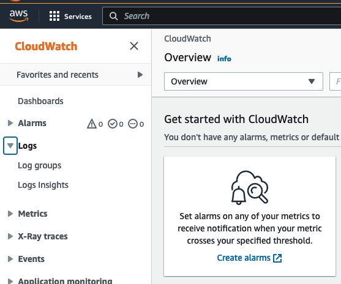
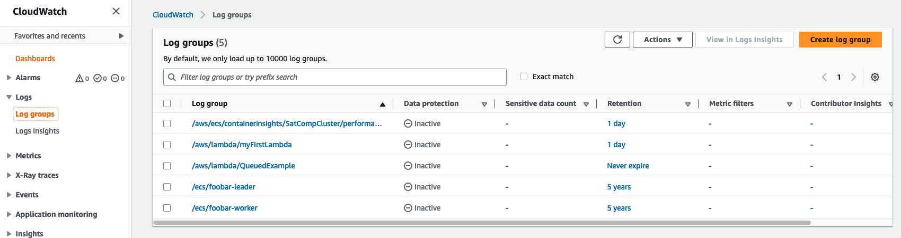
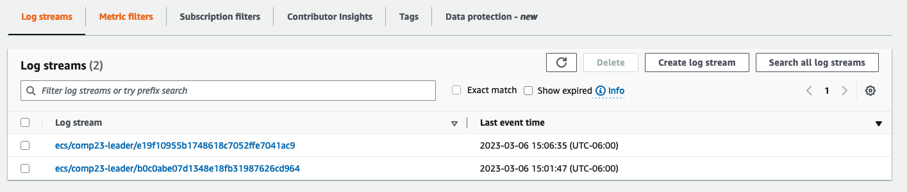
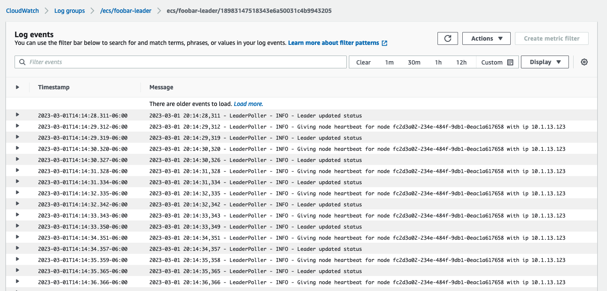

# Configuring AWS Infrastructure for SAT/SMT-Comp

This README describes how to build and configure AWS infrastructure for the SAT and SMT parallel and cloud tracks. If you are only competing in the parallel track, a handful of the steps are unnecessary. We will point out these cloud-only steps as we go.

You will proceed through the following steps.

* [Mallob Quickstart](#mallob-quickstart).  This will run through all the steps using just two scripts so that you can see an example cloud solver up and running quickly.  After we see it working, then we will explain the steps in more detail.
* [Managing AWS Solver Infrastructure](#managing-solver-infrastructure).  This section describes the infrastructure creation process in more detail, and how you can switch between parallel and cloud configurations for testing.
* [Preparing Docker Images for Upload to AWS](#preparing-docker-images).  This section describes how to upload your solver to AWS.
* [Storing Analysis Problems in the Cloud](#storing-analysis-problems-in-the-cloud).  This section describes how we store problems for your solver in S3, the main storage service for AWS.
* [Running your Solver in the Cloud](#running-your-solver).  This section describes how we run your solver in the cloud.

Additional resources are available in a FAQ:

* [FAQ/Troubleshooting](#faq--troubleshooting)

Although there is a lot of information about how to build with AWS infrastructure here, most of the development of your solver can be performed using Docker locally on your laptop as described in the [Solver Development README](../docker/README-Solver-Development.md) (even for the cloud track).  You only need to involve AWS when you want to look at performance testing on the competition hardware. 

## Prerequisites

To use the AWS infrastructure, you will need the following tools installed:

- [python3](https://www.python.org/).  To install the latest version for your platform, go to the [downloads](https://www.python.org/downloads/) page.
- [docker](https://www.docker.com/).  There is a button to download Docker Desktop on the main page.
- [boto3](https://aws.amazon.com/sdk-for-python/).  Once you have python3 installed (above), you can install this with `pip3 install boto3`. 

Basic knowledge of AWS accounts and services is helpful, but we will walk you through all of the necessary steps. 

We recommend that your development environment be hosted on Mac OS Monterey (v12.6), Amazon Linux 2 (AL2) or Ubuntu 20. Other platforms may work, but have not been tested. 

### Installing the AWS CLI

In order to work with AWS, you must install the [AWS CLI](https://aws.amazon.com/cli/) for your platform. To get started, follow the directions for your operating system here:
  [https://docs.aws.amazon.com/cli/latest/userguide/getting-started-install.html](https://docs.aws.amazon.com/cli/latest/userguide/getting-started-install.html)
If you have previously installed the AWS CLI, you should ensure it is up to date.


### Creating AWS Credentials for your AWS Account

You must configure AWS credentials to access the resources in your account. For the purposes of simplifying the competition configurations, you will use a so-called _root level access key_. This is _not_ the best practice for security (which would be to create a separate user in your account) but it will suffice for the competition (see FAQ for more information).

In this section, you will be working with the Identity and Access Management (IAM) console. To create a root level access key go to the [IAM Console](https://console.aws.amazon.com/iamv2/). You can get to the console by clicking the previous link or by searching for "IAM" in the search field at the top of the [AWS Console](https://console.aws.amazon.com) as shown [here](readme-images/iam-search.png) and then clicking the resulting link).

On the IAM page, click "My Security Credentials" on the right side of the IAM console page as shown [here](readme-images/iam-quicklinks.png). Next, click on "Access keys (access key ID and secret access key)," then "Create New Access Key," and then "Show Access Key."
This will create an Access Key ID and a Secret Access Key. Copy these for use in the next step.

Next, on your local workstation, create a `~/.aws/credentials` file containing the following text:

    [default]
    aws_access_key_id=ACCESS_KEY_ID
    aws_secret_access_key=SECRET_ACCESS_KEY
    region=us-east-1

`ACCESS_KEY_ID` and `SECRET_ACCESS_KEY` are the keys that you created in the previous step. 

After installing the AWS CLI and creating credentials, check your configuration by attempting to run an AWS command.  An example command that should work is:
```text
aws sts get-caller-identity
```

If you receive an error message, see the [FAQ/Troubleshooting](#faq--troubleshooting) section at the bottom of this document.

We recommend that when you've completed account set-up, you follow the steps in the FAQ [How Do I Track My Spending?](#how-do-i-track-my-spending) to track your spending. For now, we'll continue with the setup.

## Mallob Quickstart

To allow you to see a solver up and running quickly, we have created two commands to provide a quick start to getting a Mallob container running in AWS.  The first command: `quickstart-build` creates the AWS infrastructure for a cloud solver, builds the Mallob docker images, and uploads them to AWS.  The second command: `quickstart-run` creates a cluster to run with four nodes (1 leader and 3 workers); if it is not already running, waits for the cluster to be ready, then submits a solving job and reads the response from the output queue.  After you test out the mallob solver using these commands, you should go through the rest of the readme to see the steps that they are performing and how to do this with your own solver.  

### Quickstart Build

This command creates an account, builds Mallob (if not already built), and uploads the Docker images to AWS.  The form is simply: 

```text
./quickstart-build
```

This command will require 10-20 minutes to run.  Once it is complete, Mallob should be ready to run, and the infrastructure should be set up to run a cloud solver.

### Quickstart Run

**N.B.: For teams in China, new accounts are not configured with sufficient vCPU resources to run `quickstart-run`.  Please follow the directions in the Q&A section under: "How do I make sure I have enough vCPU capacity in my account to run my experiments?" prior to running `quickstart-run`.**   

This command will spin up a cluster, submit a job to run called `test.cnf` that we uploaded to a storage location in S3 (the AWS storage service), and wait for the result, then spins down the cluster.  The form of the command is: 

```text
./quickstart-run 
```

Once the solver is completed, you should see a message back from the solver that the problem was completed and that the result was SATISFIABLE.  Later on we will show you how to monitor a run using an AWS service called _CloudWatch_ and extract the intermediate files produced by the run, including the stdout and stderr logs, using an AWS service called _S3_.  

Voila!

Now we walk through the different steps in more detail. 

## Managing Solver Infrastructure.

The `quickstart-build` command from the previous section creates the AWS infrastructure necessary to run your solver.  In that creation process, the infrastructure is set up to run cloud (distributed) solvers.  If you want to switch to hosting a parallel solver, run the update command described in the next section.  If something goes wrong, then delete the infrastructure and re-create it as described in [Deleting and Re-creating the Infrastructure](#deleting-and-re-creating-the-infrastructure).

### Switching Between Cloud and Parallel Tracks

If you ran the Mallob `quickstart-build`, then you have already created your solver infrastructure and don't have to do any further work.  In that creation process, the infrastructure is set up for cloud (distributed) solvers.  Once the infrastructure has been created, if you want to update it to switch between machine configurations for the cloud and parallel tracks, you can run the `update-solver-infrastructure` script: 

```text
./update-solver-infrastructure --solver-type SOLVER_TYPE
```

where:
* `SOLVER_TYPE`: is either `cloud` or `parallel` depending on which kind of solver you are running. Note that we will run cloud solvers run on multiple 16-core machines ([m6i.4xlarge](https://aws.amazon.com/ec2/instance-types/)) with 64GB memory, while parallel solvers run on a single 64-core machine ([m6i.16xlarge](https://aws.amazon.com/ec2/instance-types/)) with 256GB memory.

This will change the instance type and memory configurations for the ECS images used. You can switch back and forth as needed.

### Deleting and Re-creating the Infrastructure

If something goes wrong and you want to start over, simply run the `delete-solver-infrastructure` script:
```text
./delete-solver-infrastructure 
```

This will delete the infrastructure and associated resources.  **Note that this deletion includes any files that have been uploaded to your S3 bucket and also any ECR docker images that you have created.** It will not delete your AWS account or security credentials.

Next, you will create the AWS infrastructure necessary to build and test solvers. The SAT and SMT competitions both use the following infrastructure elements.  These should "just work", but there is more information about the different parts of the infrastructure in the FAQ.  To set up your resouces, simply run the  `create-solver-infrastructure` script that we have provided.

```text
./create-solver-infrastructure --solver-type SOLVER_TYPE
```

where:
* `SOLVER_TYPE`: is either `cloud` or `parallel` depending on which kind of solver you are running. Note that we will run cloud solvers run on multiple 16-core machines ([m6i.4xlarge](https://aws.amazon.com/ec2/instance-types/)) with 64GB memory, while parallel solvers run on a single 64-core machine ([m6i.16xlarge](https://aws.amazon.com/ec2/instance-types/)) with 256GB memory.

The script will take 5-10 minutes. When complete, all of the needed cloud resources should be created.  The script polls until the creation is complete.  


## Preparing Docker Images

### Creating the Base Docker Leader and Worker Images for Solvers

See the [SAT-Comp Docker Images README.md file](../docker/README.md) in the `docker` directory for instructions on how to build and test Docker images.

### Storing Solver Images in the ECR repository

Amazon stores your solver images in the [Elastic Container Registry (ECR)](https://console.aws.amazon.com/ecr).

The `create-solver-infrastructure` command described earlier creates an ECR repository with the same name as the project (comp23).

This repository will store the images for the leader and worker.  Once you have created and tested a docker image (or images, for the cloud leader and worker) as described in the [SAT-Comp Docker Images README.md file](../Docker/README.md), you can upload them to your AWS account with the `ecr-push` script:

```text
./ecr-push [--leader LEADER_IMAGE_TAG] [--worker WORKER_IMAGE_TAG]
```

where:

* `LEADER_IMAGE_TAG` is the tagged name of the leader docker image (e.g. satcomp-mallob:leader).

* `WORKER_IMAGE_TAG` is the tagged name of the leader docker image (e.g. satcomp-mallob:worker).

The leader and worker tags are optional; you can upload one or both docker images with this command (though if neither is specified, the script exits with an error).

## Storing Analysis Problems in the Cloud

We use the AWS Simple Storage Service (S3) to store the analysis problems we want to solve with our solver.  S3 has a concept of a "bucket" which acts like a filesystem.  As part of the `create-solver-infrastructure` CloudFormation script, we have created a bucket for you where you can store files: `ACCOUNT_NUMBER-us-east-1-comp23`, and added a `test.cnf` file to this bucket for testing.  You can start with the `test.cnf` example and skip the rest of this section until you wish to add additional files or buckets for testing your solver.

You can copy files to the bucket with a command similar to this one (when executed from the root directory of this repository, this re-copies the `my-problem.cnf` file to the default bucket):

```text
aws s3 cp my-problem.cnf s3://ACCOUNT_NUMBER-us-east-1-comp23
```

When `s3 cp` is complete, you will see your file(s) in the list of objects in the bucket:

```text
aws s3 ls s3://ACCOUNT_NUMBER-us-east-1-comp23
```

More information on creating and managing S3 buckets is found here: [https://aws.amazon.com/s3/](https://aws.amazon.com/s3/). The S3 command line interface is described in more detail here: [https://docs.aws.amazon.com/cli/latest/userguide/cli-services-s3-commands.html](https://docs.aws.amazon.com/cli/latest/userguide/cli-services-s3-commands.html).

## Running Your Solver
After storing docker images: `comp23:leader` (and for the cloud solver: `comp23:worker`) and placing at least one query file in your S3 bucket, you are ready to run your solver. 

### Running Your Solver Using `quickstart-run`
You can use `quickstart-run` to spin up the cluster, run several files, and then spin down the cluster with one command.  To run files other than the `test.cnf` file, you can provide a list of s3 file paths to run, one after the other.  The command looks like: 

```text
quickstart-run [--s3-locations S3_LOCATIONS [S3_LOCATIONS ...]] 
```

In this case, after creating the cluster, it will try to run all files before spinning the cluster back down.  This allows you a relatively safe way to run several jobs.  **N.B.**: Keep an eye on it, though!  If your solver fails while solving and does not generate an output, then the script will poll forever waiting for the result message from your solver, and will not spin down the cluster.  In this case, follow the cleanup procedure below. 


### Running Your Solver Using Basic Scripts

If you would like to have finer-grained control, choosing when to spin up and down the cluster, or building your own scripts, you can use the following steps:

1. Setup.

    a. Setting capacity for the cluster in [EC2](https://aws.amazon.com/ec2/).

    b. Setting the desired number of workers in [ECS](https://aws.amazon.com/ecs/).
    
2. Run. submitting a solve job to the SQS queue by specifying the S3 location of the problem and the desired number of workers.

3. Cleanup. Setting EC2/ECS capacity for cluster back to zero.

After setup, you can run any number of solve jobs before cleaning up.

Note: It is very important that you [clean up](#cluster-teardown) once you are done. EC2 nodes that remain active continue to be charged against your account.

### Cluster Setup

To set up and tear down the ECS cluster, we have provided a script called `ecs-config`.  You provide the number of desired worker nodes as an argument. The script:
 
1. Creates an EC2 fleet large enough to run the experiment (number of workers + a leader node)
2. Creates the correct number of tasks in the ECS service for the leader and workers.

To run the script: 

```text
ecs-config setup --workers [NUM_WORKERS]
```

where: 

* `NUM_WORKERS` is the number of worker nodes you want to allocate. To avoid  problems with possible resource limits for your AWS account, we recommend that you set `NUM_WORKERS` to `1` when working through this document for the first time. If you are building for the parallel track, set `NUM_WORKERS` to `0`, as all solving will be performed by the leader node.

AWS typically requires 2-5 minutes to allocate nodes and host the ECS cluster. You can monitor the creation process by navigating to the [ECS console](https://us-east-1.console.aws.amazon.com/ecs) and selecting the _SatCompCluster_ link. [FIXME: link won't work outside us-east-1.]

The next page will show a list of job queues, including:

```text
job-queue-comp23-SolverLeaderService-...
job-queue-comp23-SolverWorkerService-...
```

The service is running and available when the number of running tasks for the leader is `1` and the number of running tasks for the Worker service is `n`, as chosen with `NUM_WORKERS` in the `ecs-config` script argument.

Note: Your AWS account is charged for the number of EC2 instances that you run, so your bill will rise with the number of workers that you allocate.  

### Job Submission and Execution

Before submitting a job, check that a cluster is set up and running, and the desired problem is available in an accessible S3 bucket.

Solver jobs are submitted by sending SQS messages. We have provided a `send_message` script to do this for you. You provide the S3 location of the file to run and number of desired worker nodes. The script submits an SQS request to the `ACCOUNT_NUMBER-us-east-1-SatCompQueue` queue, which the solver leader container is monitoring. 

To run the script: 

```text
send_message --location S3_LOCATION --workers NUM_WORKERS [--timeout TIMEOUT] [--name NAME] [--format FORMAT] [--args ARGS]
```

with required arguments:
* `S3_LOCATION` is the S3 location of the query file. For example, for the bucket we described earlier, the location would be `s3://ACCOUNT_NUMBER-us-east-1-comp23/test.cnf`.
* `NUM_WORKERS` is the number of worker nodes to allocate for this problem. Again, we recommend that you start with `NUM_WORKERS` as `1` when beginning. For parallel solvers, you should set `NUM_WORKERS` to `0`.

and optional arguments:
* `TIMEOUT` is an optional parameter that sets the timeout in seconds for the solver.  Defaults to 60s.
* `NAME` is an optional parameter providing a name for the solver (in case you want to host multiple solvers within one container.  Defaults to the empty string)
* `FORMAT` is an optional parameter providing the problem format.  Defaults to the empty string.
* `ARGS` is an optional parameter allowing one or more arguments to be passed to the solver.  Defaults to the empty list. 

The leader container will pull the message off of the queue, fetch the problem from S3, and begin execution. For more information on the steps performed, see [Extending the Solver Base Container](#understanding-the-solver-architecture-and-extending-the-competition-base-leader-container) below.  

### Debugging on the Cloud: Monitoring and Logging

Debugging takes more effort on the cloud than on your local machine, because it takes time to upload your solver and deploy it, and observability can be reduced.  Debug first at small scale on your local machine as described in the [Solver Development README](../docker/README-Solver-Development.md).  

To debug on the cloud, there are two main mechanisms that we use to examine our solvers:
1. CloudWatch log groups, which allow a real-time view of stdout and stderr from your solver.  
1. S3 storage of intermediate files, which allows you to dump files that you can inspect after the run.

**CloudWatch Log Groups:** To watch the logs in real-time you can navigate to the CloudWatch console, then choose the "log groups" item on the left side menu as shown in Figure 2.

 
_Figure 2: CloudWatch log groups menu_

After choosing the log groups menu item, you should see logs related to `/ecs/comp23-leader` and `/ecs/comp23-worker` as shown in Figure 3.  

 
_Figure 3: CloudWatch log groups view_

These logs will capture both stdout and stderr from your solver containers.  The logs are captured in something called _streams_, usually tied to a specific instance (so, for a cluster you will have one stream for the leader and one for each worker).  Note that if you don't use a solver for a while, CloudWatch will close the stream and open a new one, as you see in Figure 4: 


_Figure 4: CloudWatch log groups view_

The logs themselves are visible as lists of events as shown in Figure 5:


_Figure 5: CloudWatch log items view_

AWS provides a very full-featured log query language called [CloudWatch Logs Insights](https://docs.aws.amazon.com/AmazonCloudWatch/latest/logs/AnalyzingLogData.html) (visible in the menu in Figure 2) that you can use to search for specific patterns within logs that can often help speed up your debugging.  A full discussion of insights is outside the scope of this document, but the link above leads to a full set of documentation about how use it.

**S3 Storage of Intermediate Files:**
When the solver is invoked we store the `input.json` file and the analysis problem in a temporary directory that is passed as the argument to the solver.  We recommend that you use the same directory (or create a subdirectory) for storing all of the intermediate files used during solving.  At the conclusion of solving, all contents in this directory _for the leader solver_ will be uploaded to your S3 bucket (`ACCOUNT_NUMBER-us-east-1-comp23`) under a `/tmp/UUID` directory with a unique UUID so that you can inspect them offline.  This way, you can instrument your solvers to write to the filesystem for later analysis.  **N.B.:** currently this is only available for the leader solver; however, we may add the capability to upload data from the workers depending on customer feedback.  If you store the stdout and stderr logs to this directory (as the Mallob example does), then the output message produced by the solver will identify the UUID used for the bucket for easy reference.

### Cluster Teardown

After testing, remember to tear down the cluster by running: 

```text
ecs-config shutdown
```

This will terminate all EC2 instances and reset the number of leaders and workers to zero in the ECS service. 

You should verify that no EC2 instances are running after running the teardown script. Navigate to the [EC2 console](https://console.aws.amazon.com/ec2) and check the `Instances` tab.  There should be no running instances.  Note that it might take a minute or two for the instances to shut down after running the script.

Note: You are responsible for any charges made to your AWS account.  While we have tested the shutdown script and believe it to be robust, you are responsible for monitoring the EC2 cluster to make sure resources have shutdown properly. We have alternate directions to shutdown resources using the console in the Q&A section.


## FAQ / Troubleshooting

#### How Do I Track My Spending?

[AWS CloudFormation](https://aws.amazon.com/cloudformation/) can be used to automate many cloud configuration activities. The file `setup-account.yaml`[setup-account.yaml] in this repository is an optional CloudFormation script that can help you track your spending.  It sets up notification emails to be sent via  email when your account reaches 20%, 40%, 60%, 80%, 90%, 95%, and 100% of the monthly account budget. This will provide a window into the current spend rate for building and testing your solver.

Here is the command to run it:

    aws cloudformation create-stack --stack-name setup-account-stack --template-body file://setup-account.yaml --parameters ParameterKey=emailAddress,ParameterValue=YOUR_EMAIL_ADDRESS

_Note_: Be sure to double check the email address is correct! 

After running the aws cloudformation command, you can monitor the installation process by logging into your AWS account and navigating to the [CloudFormation console](https://console.aws.amazon.com/cloudformation).
Make sure you are in the us-east-1 region (You can select the region in the top right corner of the console page).
You should see a stack named `setup-account-stack`.

 
_Figure 1: Cloudformation result_

By clicking on this stack, and choosing `events`, you can see the resources associated with the stack.  After a short time, you should see the `CREATE_SUCCEEDED` event. If not (e.g., the email address was not valid email address syntax), you will see a `CREATE_FAILED` event. In this case, delete the stack and try again. If you have trouble, email us at: [sat-comp@amazon.com](mailto:sat-comp@amazon.com) and we will walk you through the process.

Although it is handy to get emails when certain account budget thresholds have been met, it is both useful and important to check by-the-minute account spending on the console: [https://console.aws.amazon.com/billing/home](https://console.aws.amazon.com/billing/home).


#### I'm only submitting to the parallel track and not the cloud track.  Do I need a worker image?

No. If you are submitting to the parallel track only, you do not need a worker image.  For the parallel track, we will assume that the leader manages all threading and communications within the single (multi-core) compute node.

#### I attempted to use the quickstart-run or config-ecs, but the script keeps saying "Waiting for ECS" and not running my solver.  What happened?

If you just started the script, then it is likely that either the requested EC2 servers have not yet initialized, or that the ECS cluster has not yet started running on them. It typically takes 5-10 minutes for the resources to become available after they are requested.  If it takes longer than 15 minutes, there is a problem.  Either the region has entirely run out of resources (unlikely), or your account does not have a high enough resource cap to support the cluster you have requested.  See the Q&A for "How do I make sure I have enough vCPU capacity in my account to run my experiments?".

If you have sufficient capacity in your account and are still seeing this message, please contact us via email so that we can investigate.

#### How do I make sure I have enough vCPU capacity in my account to run my experiments?
EC2 sets default capacity limits on the number of compute nodes that are available to an account.  For the USA and Europe, these are currently defaulted to 640 vCPUs, so unless you are running a distributed cluster with more than 39 workers (which is expensive!), the default limit should be o.k.  However, in China, the current default limit appears to be 32 vCPUs, which is not even enough to run the `quickstart-run` script.  

To check your account limits, navigate to the EC2 console for the account, and click on "Limits" on the left side. Type "All standard" in the search bar and determine the current limit. The limit is specified in terms of vCPUs, so each m6i-4xlarge image uses 16 vCPUs, and every m6i-16xlarge uses 64 CPUs. If you need additional vCPUs, click on the "All Standard" link and request a limit increase.  Turnaround time is usually around 24 hours for these requests.  Additional information on requesting increases can be found in the following [video](https://www.youtube.com/watch?v=F4zE3yVp-gg).  **N.B. Running a large cluster can become expensive. Make sure you limit your large-scale testing to preserve your AWS credits.**


#### I submitted a job but nothing happens.  When I look in the logs, the leader keeps saying it is waiting for worker nodes and not running my solver.  What happened? ####

If you were able to create the cluster successfully using ecs_config, then what has happened is that you submitted an SQS that asked for more workers than you configured when you set up your cluster.  Make sure that the number of worker nodes equals or exceeds the number of worker nodes that were requested in the SQS message. 

#### I'm watching the ECS cluster, but nothing is happening; no nodes are being created.  What happened?

This can happen if you try to start up a cloud solver when the infrastructure is configured for parallel execution or vice versa.  In this case, the machine image where you want to deploy does not match the requirements of the ECS task.  Make sure that if you are running a cloud solver, you have not configured the infrastructure for parallel.  If you are unsure, you can always run `update-solver-infrastructure` with the expected type.  If the infrastructure is already set up for this type, it will be a no-op.


#### How do I manage my account after SAT-Comp if I want to follow security best practices?

If you continue using your AWS account after the competition, we recommend that you follow AWS best practices as described here:
    [https://docs.aws.amazon.com/IAM/latest/UserGuide/best-practices.html#create-iam-users](https://docs.aws.amazon.com/IAM/latest/UserGuide/best-practices.html#create-iam-users)

#### I ran the infrastructure scripts, and they seemed to work, but when I go out to the console, I don't see any of the infrastructure: S3 buckets, ECS Queues, etc. What happened?

The most common mistake people make when starting with AWS is not choosing the correct *region* for executing their jobs.  In the console on the top right there is a selectable region:


Make sure that the region selected in the top-right of the console page is `us-east-1`. 


#### What are the sequence of steps performed by the leader container to set up the `input.json' file?

The leader infrastructure performs the following steps: 

1. Pull and parse a message from the `ACCOUNT_NUMBER-us-east-1-SatCompQueue` SQS queue with the format described in the [Job Submission and Execution section](../infrastructure/README.md#fixme).  
1. Pull the appropriate solver problem from S3 from the location provided in the SQS message.
1. Save the solver problem on a shared EFS drive so that it can also be accessed by the worker nodes.
1. Wait until the requested number of workers have reported their status as READY along with their IP addresses.
1. Create a working directory for this problem.
1. Create and write an `input.json` with the IP addresses of the worker nodes as well as the location of the problem to the working directory
1. Invoke the executable script located at path `/competition/solver` with a single parameter: the path to the working directory. The solver script will look for the `input.json` file in the working directory. It is also the location where solver output and error logs will be written.  
1. The return code for `/competition/solver` will determine the expected result for the solver: A return code of 10 indicates SAT, 20 indicates UNSAT, 0 indicates UNKNOWN, and all other return codes indicate an error.
1. Upon task completion, notify all workers that the task has ended.


#### Suppose I want to use the console to setup my ECS clusters, or to monitor them.  How do I do that?

__Step 1:__  Update the size of the EC2 cluster using the EC2 console

To control the instances in your cluster, go to the EC2 console and scroll down on the left side of the console and click on the link that says "Auto Scaling Groups".

In the next page, you will see an autoscaling group called something like `job-queue-comp23-EcsInstance`.

1. Select the queue by clicking on it, then click the "Edit" button in the "Group details" section.
1. Set the desired, and maximum task capacity to n (where n includes 1 leader and n-1 workers, so there is a minimum useful size of 2), and click "Update".

__Step 2:__ Update the size of the ECS task pool for the leader and workers

Navigate to the ECS console, then select the SatCompCluster link.

The next page should show a list of job queues, including:

```text
job-queue-comp23-SolverLeaderService-...
job-queue-comp23-SolverworkerService-...
```

Click on the SolverLeaderService job queue and choose "Update".  Set the number of tasks to 1, then choose "Skip to review", then click "Update Service".  You should then navigate back to the SatCompCluster link and click on the SolverWorkerService link.  Choose "Update" and set the number of tasks to n-1, where 'n' is the number of EC2 nodes you created in Setup Step 1.

Please allow 2-3 minutes for the instances to boot up and register with the cluster.  When registered, you should see 1 desired and 1 running task for the leader and n-1 desired tasks for the worker in the SatCompCluster screen.

If you get the following error, it means that your instances have not yet booted up:

```text
An error occurred (InvalidParameterException) when calling the RunTask operation: No Container Instances were found in your cluster.
```

If they fail to boot up after 5 minutes, please verify that both Desired Capacity and Maximum Capacity are set correctly.

You incur costs for the time the cluster is running. 

#### Suppose I want to use the console to tear down my ECS clusters.  How do I do that?

To control the instances in your cluster, go to the EC2 console and scroll down on the left side of the console and click on the link that says "Auto Scaling Groups".
 
In the next page, you will see an autoscaling group called something like job-queue-comp23-EcsInstance.
 
1. Select the queue by clicking on it, then click the "Edit" button in the "Group details" section.
1. Set the desired and maximum task capacity to 0.  This shuts down any EC2 instances.
 

#### What are the various AWS services that are used in the infrastructure?

The infrastructure pieces are as follows: 

* Compute resources necessary to host solvers, provided by the [Elastic Compute Cloud](https://aws.amazon.com/ec2/) (EC2) service.
* A registry for solver Docker image files, provided by the [Elastic Container Registry](https://aws.amazon.com/ecr/) (ECR) service.
* A compute environment to support automated launching of containers on compute resources, provided by the [Elastic Container Service](https://aws.amazon.com/ecs/) (ECS) service.  
* A storage location for solver queries that uses the [Simple Storage Service](https://aws.amazon.com/s3/) (S3) service.
* A distributed file system that can be used for communication between leader and worker solvers, using the [Elastic File System](https://aws.amazon.com/efs/) (EFS) service.
* A problem queue that the solver leader uses to extract the next problem to solve, provided by the [Simple Queue Service](https://aws.amazon.com/sqs/) (SQS).

You can click the links about for more specifics on each each of the services.  

#### Suppose I want to use the console to send SQS messages to start executing jobs. How do I do that?

Submit a job using the [Simple Queue Service (SQS) console](https://console.aws.amazon.com/sqs/).

1. Navigate to the SQS console, and select the queue named `ACCOUNT_NUMBER-us-east-1-SatCompQueue`.
2. Click the *SendAndReceiveMessages* button
3. Set the message body to something matching the following structure:

```text
{"s3_uri":"s3://PATH_TO_CNF_PROBLEM",
 "num_workers": DESIRED_NUMBER_OF_WORKERS}
```

For example, for the bucket we described earlier, given a cluster with two nodes (one worker), it would be:

```text
{"s3_uri":"s3://ACCOUNT_NUMBER-us-east-1-satcompbucket/test.cnf",
"num_workers": 1}
```

#### What if I want to create different buckets other than the one provided for storing problems in?

In case you wish to create a different bucket, here is a command to create a bucket named `comp23-satcomp-examples`:

```text
aws s3api create-bucket --bucket comp23-satcomp-examples
```

Notes: 
 
 - This will create the bucket in the AWS region specified in your named profile

- If you chose a different region than `us-east-1`, you might get an `IllegalLocationConstraintException`. To deal with the problem, you have to append the argument `--create-bucket-configuration {"LocationConstraint": "YOUR-REGION-NAME"}` to the command, where `YOUR-REGION-NAME` is replaced with the name of the region you chose.

- S3 buckets are globally unique across all of AWS, which means that the command will fail if someone else is already using the same bucket name.  A simple fix is to add the AWS account number to the bucket name, which will likely yield a unique bucket name.

#### I'd like to know more about how the Elastic Container Registry works.  Can I do the steps to upload files by hand?

Amazon stores your solver images in the [Elastic Container Registry (ECR)](https://console.aws.amazon.com/ecr).

The `create-solver-infrastructure` command described earlier creates an ECR repository named `comp23`.


This repository store the images for the leader and worker.  

The repository has an associated URI (shown on the console page), which is what we use to push docker images to ECR.
The format for URIs is

```text
ACCOUNT_NUMBER.dkr.ecr.us-east-1.amazonaws.com/comp23
```

You will use these URIs to describe where to store our Docker images in AWS.  

Note: a good way to make sure that you type these URI names correctly is to navigate to the Elastic Container Registry (ECR) console in AWS and copy them from the page (the names are in the URI column).   


To store a Docker image in ECR from your local machine, first you need to login to ECR:

```text
aws ecr get-login-password --region us-east-1 | docker login --username AWS --password-stdin AWS\_ACCOUNT\_ID.dkr.ecr.us-east-1.amazonaws.com
```

Next, you need to tag the image to match the ECR repository.  For the worker, tag the image as:

```text
docker tag [LOCAL_WORKER_IMAGE_ID] [AWS_ACCOUNT_NUMBER].dkr.ecr.us-east-1.amazonaws.com/comp23:worker
```

where 

* **LOCAL\_WORKER\_IMAGE\_ID** is the local worker image tag (e.g., `comp23:worker`).  
* **AWS\_ACCOUNT\_ID** is the account ID where you want to store the image.

For the leader, tag the image as:

```text
docker tag LOCAL_LEADER_IMAGE_ID ACCOUNT_NUMBER.dkr.ecr.us-east-1.amazonaws.com/comp23:leader
```

where 

* **LOCAL\_LEADER\_IMAGE\_ID** is the local image for the leader, and the other parameters are the same as for the worker.

After these steps, you can docker push the images:

```text
docker push ACCOUNT_NUMBER.dkr.ecr.us-east-1.amazonaws.com/comp23:leader
docker push ACCOUNT_NUMBER.dkr.ecr.us-east-1.amazonaws.com/comp23:worker
```

You should see network progress bars for both images.

More information related to the ECR procedures is described here: [https://docs.aws.amazon.com/AmazonECR/latest/userguide/docker-push-ecr-image.html](https://docs.aws.amazon.com/AmazonECR/latest/userguide/docker-push-ecr-image.html).

If you have trouble, please email us at: [sat-comp@amazon.com](mailto:sat-comp@amazon.com) and we will walk you through the process.
